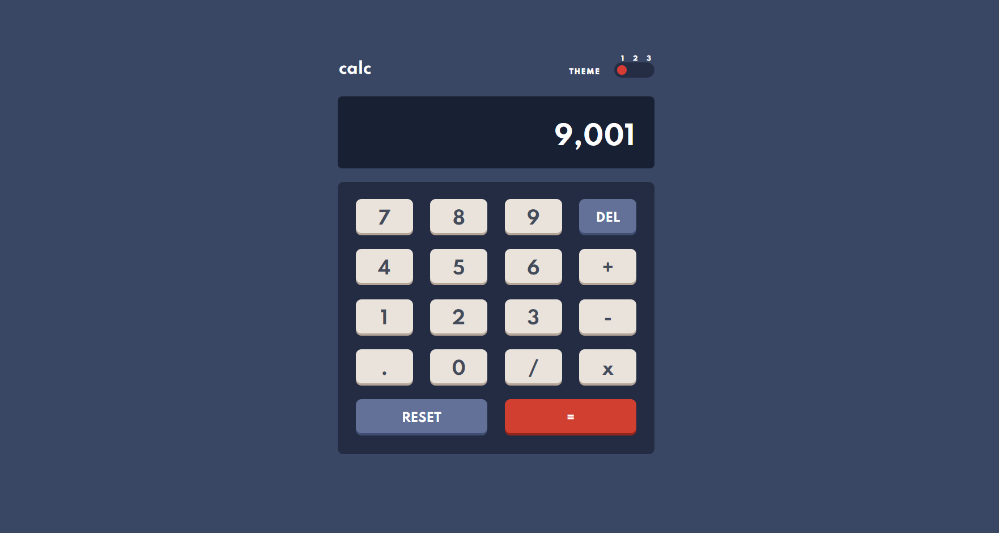

# Frontend Mentor - Calculator app solution

This is a solution to the [Calculator app challenge on Frontend Mentor](https://www.frontendmentor.io/challenges/calculator-app-9lteq5N29). Frontend Mentor is a platform which provides project challenges designed to hone front-end coding skills.

## Table of contents

- [Overview](#overview)
  - [The challenge](#the-challenge)
  - [Screenshot](#screenshot)
  - [Links](#links)
- [My process](#my-process)
  - [Built with](#built-with)
  - [What I learned](#what-i-learned)
  - [Continued development](#continued-development)
  - [Useful resources](#useful-resources)
- [Author](#author)
- [Acknowledgments](#acknowledgments)

## Overview

### The challenge

Users should be able to:

- See the size of the elements adjust based on their device's screen size
- Perform mathmatical operations like addition, subtraction, multiplication, and division
- Adjust the color theme based on their preference
- Have their initial theme preference checked using `prefers-color-scheme` and have any additional changes saved in the browser

### Screenshot



### Links

- Solution URL: [CalculatorApp](https://loganrennick.github.io/calculator-app)

## My process

### Built with

- Semantic HTML5 markup
- Flexbox
- CSS Grid
- [Bootstrap](https://getbootstrap.com/) - front-end framework
- [Angular](https://angular.io/) - web application framework
- [Typescript](https://www.typescriptlang.org/) - programming language, compiles to Javascript
- [Sass](https://styled-components.com/) - preprocessor scripting language for CSS

### What I learned

Use this section to recap over some of your major learnings while working through this project. Writing these out and providing code samples of areas you want to highlight is a great way to reinforce your own knowledge.

To see how you can add code snippets, see below:

```html
<h1>Some HTML code I'm proud of</h1>
```
```css
.proud-of-this-css {
  color: papayawhip;
}
```
```js
const proudOfThisFunc = () => {
  console.log('🎉')
}
```

If you want more help with writing markdown, we'd recommend checking out [The Markdown Guide](https://www.markdownguide.org/) to learn more.

### Continued development

Use this section to outline areas that you want to continue focusing on in future projects. These could be concepts you're still not completely comfortable with or techniques you found useful that you want to refine and perfect.

### Useful resources

- [CSS Tricks - A Complete Guide to Grid](https://css-tricks.com/snippets/css/complete-guide-grid/) - This helped me for XYZ reason. I really liked this pattern and will use it going forward.
- [Markdown Tutorial](https://www.markdowntutorial.com/) - This is an amazing article which helped me finally understand XYZ. I'd recommend it to anyone still learning this concept.
- [Sass Theming: The Neverending Story](https://www.sitepoint.com/sass-theming-neverending-story/) - loremipusm

## Author

- Frontend Mentor - [@loganrennick](https://www.frontendmentor.io/profile/loganrennick)

## Acknowledgments

This is where you can give a hat tip to anyone who helped you out on this project. Perhaps you worked in a team or got some inspiration from someone else's solution. This is the perfect place to give them some credit.
